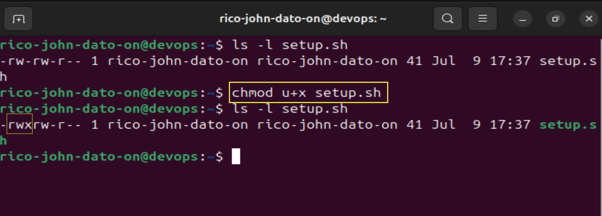
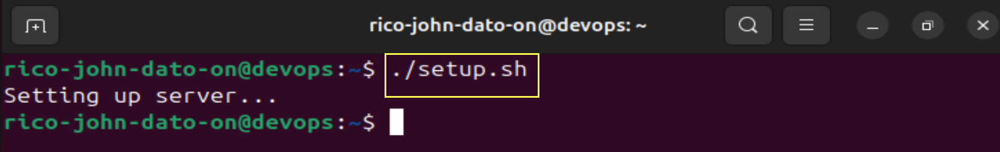
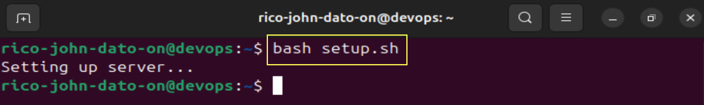
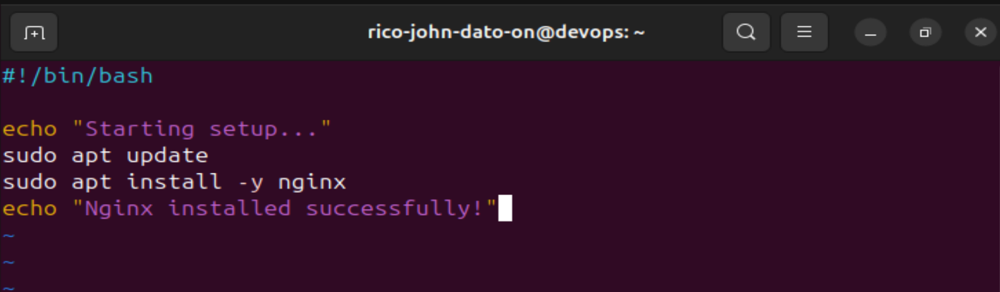

# Bash Scripting

## Overview

This document introduces shell scripting using Bash, a powerful tool for automating tasks in Unix-like systems.

## What is a Shell?

A **shell** is a command-line interface that allows users to interact with the operating system. It interprets user commands and communicates with the system kernel.

## Bash - The Bourne Again Shell

**Bash** is a widely used shell that extends the capabilities of the original Bourne shell (`sh`). It is the default shell on most modern Unix-like systems.

## Why Use Bash Scripts?

- Automate repetitive tasks
- Configure multiple servers efficiently
- Include logic and control flow
- Perform bulk operations
- Share and version system configurations

## Writing a Bash Script


1. Create a file with a `.sh` extension (e.g., `setup.sh`)
2. Start with a **shebang** line:

   ```bash
   #!/bin/bash
   ```

3. Add your commands:
   ```bash
   echo "Setting up server..."
   ```

## Making a Script Executable

Use the following command:

```bash
chmod u+x setup.sh
```



## Running a Script

Run the script with:

```bash
./setup.sh
```



Or directly with Bash:

```bash
bash setup.sh
```



## Sample Script

```bash
#!/bin/bash

echo "Starting setup..."
sudo apt update
sudo apt install -y nginx
echo "Nginx installed successfully!"
```



## Best Practices

- Use clear, consistent formatting
- Comment your code
- Use meaningful variable names
- Handle errors and use `exit` codes

## Conclusion

Bash scripting is a critical skill for DevOps engineers and system administrators. With it, you can automate workflows, manage servers efficiently, and improve productivity.

🧑‍💻 _Created by Rico John Dato-on_  
🔗 [LinkedIn](https://www.linkedin.com/in/rico-john-dato-on) • [Portfolio](https://ricodatoon.netlify.app)
